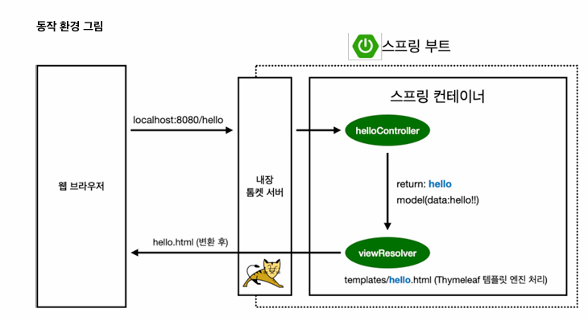

# 스프링 부트, 웹 MVC, DB 접근기술

## 목차
1. [프로젝트 생성](#프로젝트-생성)
2. [라이브러리](#라이브러리)
3. [View 환경설정](#View-환경설정)
4. [빌드](#빌드)
5. [정적컨텐츠](#정적-컨텐츠)
6. [MVC 와 템플릿 엔진](#MVC-와-템플릿-엔진)
7. [API 방식](#API-방식)
8. [간단한 회원 프로젝트 (간단한 전체적인 흐름)](./Readme/Project.md) 

[간단한 회원 프로젝트로 이동](./Readme/Project.md)

---

## 프로젝트 생성

https://start.spring.io/ 해당 주소에서 Spring boot 를 생성한다.


<span style="color:red">Group</span> : 보통 회사 도메인 <br>
<span style="color:red">Artifact</span> : 빌드된 결과물 (프로젝트 명)


라이브러리 추가 부분이고 웹을 사용할거니 <span style="color:red">Spring Web </span>추가 <br>
HTML에서 사용할 템플릿 엔진인 <span style="color:red">Thymeleaf </span>사용

---

### build.gradle

```java
plugins {  
    id 'java'  
    id 'org.springframework.boot' version '3.4.4'  
    id 'io.spring.dependency-management' version '1.1.7'  
}  
  
group = 'hello'  
version = '0.0.1-SNAPSHOT'  
  
java {  
    toolchain {  
       languageVersion = JavaLanguageVersion.of(17)  
    }  
}  
// mavenCentral 에서 해당 라이브러리를 다운  
repositories {  
    mavenCentral()  
}  
  
dependencies {  
    implementation 'org.springframework.boot:spring-boot-starter-thymeleaf'  
    implementation 'org.springframework.boot:spring-boot-starter-web'  
    testImplementation 'org.springframework.boot:spring-boot-starter-test'  
    testRuntimeOnly 'org.junit.platform:junit-platform-launcher'  
}  
  
tasks.named('test') {  
    useJUnitPlatform()  
}
```

<span style="color:red">dependencies</span> 를 통해 우리가 다운로드한 웹서버, Thymeleaf를 사용할수있게 <span style="color:red">의존성 추가</span>

---

### 프로젝트를 실행시


<span style="color:#00b050">Tomcat을 통해 http 8080 포트에 실행</span>시켰다는 의미가뜬다.<br>
http://localhost:8080/ 해당 주소로 실행이 된다.
<br>

[목차로 돌아가기](#목차)

---

## 라이브러리


확인을 해보면 Web 과 Thymeleaf를 라이브러리를 사용했지만 <br>
각각 필요한 라이브러리를 가져오기에 많은 라이브러리를 사용한다.

---

### 일반적으로 사용하는 라이브러리

+ 스프링 부트 라이브러리
    + spring-boot-starter-web
        + spring-boot-starter-tomcat: 톰캣 (웹서버)
        + spring-webmvc: 스프링 웹 MVC
    + spring-boot-starter-thymeleaf: 타임리프 템플릿 엔진(View)
    + spring-boot-starter(공통): 스프링 부트 + 스프링 코어 + 로깅
        + spring-boot
            + spring-core
        + spring-boot-starter-logging
            + logback, slf4j

+ 테스트 라이브러리
    + spring-boot-starter-test
        + junit: 테스트 프레임워크
        + mockito: 목 라이브러리
        + assertj: 테스트 코드를 좀 더 편하게 작성하게 도와주는 라이브러리
        + spring-test: 스프링 통합 테스트 지원

이러한 형태로 라이브러리를 사용한다.

[목차로 돌아가기](#목차)

---

## View 환경설정

기본적인 환경에서 Spring boot 에서는 resources/static/index.html 을 자동으로 잡아주고 찾는다.




```java  
@Controller  
public class HelloController {  
  
    @GetMapping("hello")  
    public String hello(Model model){  
        model.addAttribute("data", "hello!!");  
        return "hello";  
    }  
}
```

**@Controller로 등록시켜주면 웹 브라우저에서 요청하는걸 해결해줄 수 있다.**<br>
한 예시로) /hello를 웹 브라우저에서 호출시 해당되는 GetMapping 을 호출해주고 <br>
model를 통해 html에 존재하는 thymeleaf 에 해당되는 데이터를 넣어주면서 html를 반환해준다.

이때 컨트롤러에서 리턴값으로 반환하는건 뷰 리졸버(viewResolver)가 화면을 찾아서 처리해준다.
+ 스프링 부트 템플릿엔진 기본 viewName 매핑
+ resource:templates/ +(viewName) + .html 형식으로 반환해준다.

---

### TMI

참고로 <span style="color:red">spring-boot-devtools</span> 를 통해 서버 재시작없이 html 새로고침으로 수정가능

의존성 추가하고 2가지 설정더해야된다.

아래와 같이 설정하고 재실행하면 자동으로 새로고침 적용이된다.

첫번째 설정)


<br>

두번째 설정)


[목차로 돌아가기](#목차)

---

## 빌드

cmd에서 해당 폴더로 이동후에 다음과 같은 명령어 사용하면된다.

```
윈도우 OS 기준  
gradlew clean build  -> cd build -> cd libs -> java -jar xxx.jar

리눅스 OS 기준
./gradlew clean build  -> cd build -> cd libs -> java -jar xxx.jar
```

배포할시 만들어놓은 jar 폴더만 배포하면 끝이다.<br>
이유는 [김영한 Spring boot](https://github.com/Hasegos/Concept/blob/main/Spring/SpringBoot.md)  해당 내용 참고 바란다.

[목차로 돌아가기](#목차)

---

## 정적 컨텐츠

우선순위 Controller > static 순이다.

웹 브라우저에서 요청이들어오면 스프링 컨테이너에 있는 <span style="color:red">@Controller</span>에서 먼저 찾아본다 <br>
이후에 없으면<span style="color:red"> static </span>안에 해당 html이 있으면 반환해준다.


[목차로 돌아가기](#목차)

---

## MVC 와 템플릿 엔진

MVC : Model, View, Controller <br>

Model -> 데이터를 넘겨주는데 있어서 사용해야된다.<br>

View -> 사용자에게 화면 출력을 해준다.<br>

Controller -> 해당 url이 들어왔을 때 로직을 수행해준다.<br>

```html
<p th:text="'hello ' +${name}">hello! empty</p>
```
해당 Thymeleaf 엔진에서는 해당 내용으로 치환이된다.
```java
@GetMapping("hello-mvc")  
public String helloMvc(@RequestParam(value = "name", required = false) String name, Model model){  
    model.addAttribute("name", name);  
    return "hello-template";  
}
```

@RequestParam 은 기본적으로<span style="color:red"> required는 true</span>이기에 <span style="color:#b48ead">url에 xxx?name=value 값을 넘겨줘야된다.</span>


[목차로 돌아가기](#목차)

---

## API 방식

@ResponseBody 는 http의 body부분에 데이터를 직접 넣어주겠다

```java
@GetMapping("hello-string")  
@ResponseBody 
public String helloString(@RequestParam("name") String name){  
    return "hello" + name;  
}
```

Spring에서 @ResponseBoy 를 사용하고 객체를 반환하면, JSON 방식을 반환하게된다.

```java
// API 방식  
@GetMapping("hello-api")  
@ResponseBody  
public Hello helloApi(@RequestParam("name") String name){  
    Hello hello = new Hello();  
    hello.setName(name);  
    return hello;  
    // <html></html> xml 방식으로 하긴하지만, 너무 무겁다    
}  
  
static class Hello{  
    private String name;  
  
    public String getName(){  
        return name;  
    }  
  
    public void setName(String name){  
        this.name = name;  
    }  
}
```

@ResponseBody 를 통해 객체인지 문자열인지 구분해서 반환해주고<br> 이때 반환할때 타입을 다르게 설정이 가능하다 ex) Xml 등등


[목차로 돌아가기](#목차)